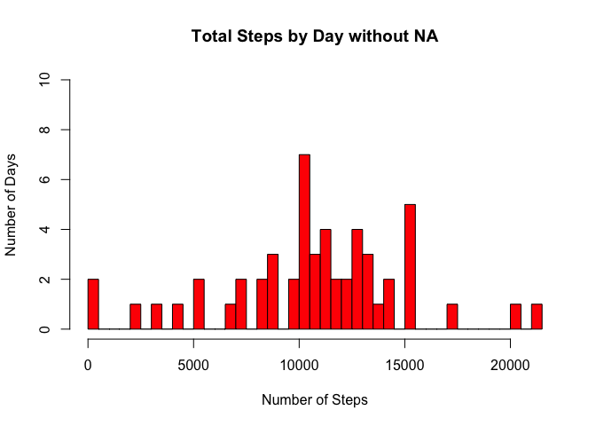
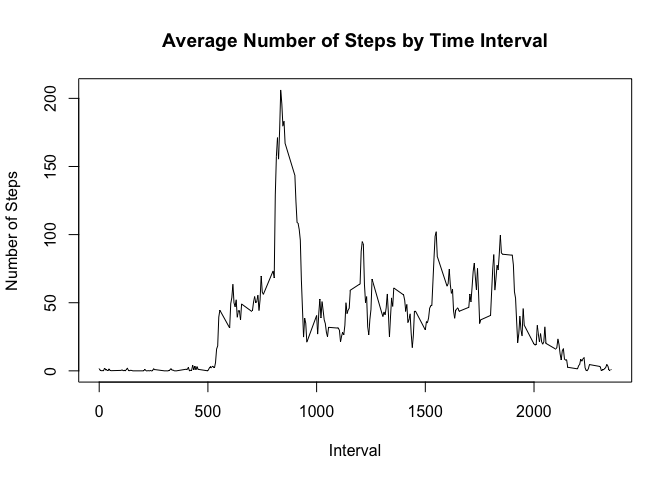
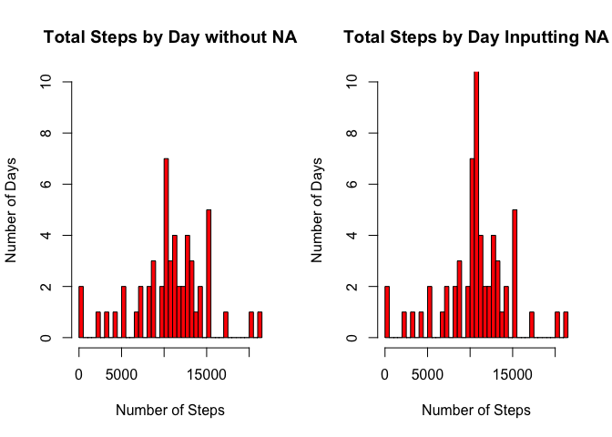
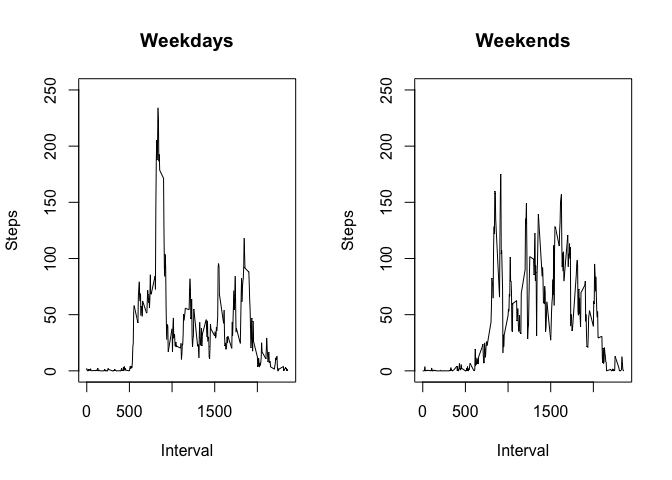

## Loading and preprocessing the data

For further processing I've removed any NA and converted class of the date column to Year/Month/Day with the package Lubridate


```r
activity <- read.csv("~/R Studio Files/Scripts/RepData_PeerAssessment1/activity.csv")
Processed <- activity[!is.na(activity$steps), ]
library(lubridate)
```

```
## 
## Attaching package: 'lubridate'
```

```
## The following objects are masked from 'package:base':
## 
##     date, intersect, setdiff, union
```

```r
Processed$date <- ymd(Processed$date)
```

## What is mean total number of steps taken per day?
To find mean and median steps taken per day I first create a new data set aggregating the number of steps per day. I can then use this data set to create a histogram to further show amount of steps taken.

```r
byday <- aggregate(steps ~ date, data = Processed, sum)

mean(byday$steps)
```

```
## [1] 10766.19
```

```r
median(byday$steps)
```

```
## [1] 10765
```

```r
hist(as.numeric(byday$steps), 
    breaks = 50, 
    xlab = "Number of Steps", 
    ylab = "Number of Days", 
    main = "Total Steps by Day without NA", 
    col = "red", 
    ylim = c(0,10))
```

<!-- -->

## What is the average daily activity pattern?
To identify avergae daily activity pattern, I first create a new data set aggregating the average number of steps per time interval. This data set can then be used to plot the average actervity pattern throughout the day.


```r
byinterval <- aggregate(steps ~ interval, data = Processed, mean)

plot(byinterval$interval, byinterval$steps, 
    type = "l", 
    xlab = "Interval", 
    ylab = "Number of Steps", 
    main = "Average Number of Steps by Time Interval" )
```

<!-- -->

The interval with the max amount of steps can then be found by:

```r
byinterval[which.max(byinterval$steps),]
```

```
##     interval    steps
## 104      835 206.1698
```

## Imputing missing values
First we must identify how many NA are comprised in the data set

```r
sum(is.na(activity))
```

```
## [1] 2304
```

I then create a new data set inputting the average number of steps per interval for each of the missing values. 

```r
InputtedNAs <- activity
avginterval <- tapply(InputtedNAs$steps,InputtedNAs$interval,mean,na.rm=T)
InputtedNAs$steps[is.na(InputtedNAs$steps)] <- avginterval[as.character(InputtedNAs$interval[is.na(InputtedNAs$steps)])]
```

Here is the comparison of the data set without NA and the data set where we inputted the NA with the average interval. Both mean and median are very simular.

```r
bydayna <- aggregate(steps ~ date, data = InputtedNAs, sum)

par(mfrow=c(1,2))
hist(as.numeric(byday$steps), 
    breaks = 50, 
    xlab = "Number of Steps", 
    ylab = "Number of Days", 
    main = "Total Steps by Day without NA", 
    col = "red", 
    ylim = c(0,10))
hist(as.numeric(bydayna$steps), 
    breaks = 50, 
    xlab = "Number of Steps", 
    ylab = "Number of Days", 
    main = "Total Steps by Day Inputting NA", 
    col = "red",
    ylim = c(0,10))
```

<!-- -->

```r
mean(bydayna$steps)
```

```
## [1] 10766.19
```

```r
median(bydayna$steps)
```

```
## [1] 10766.19
```

## Are there differences in activity patterns between weekdays and weekends?
To dig deeper into the pattern of activity during the week vs the weekends, I first identified which days are either "Saturday" or "Sunday". I then bind a new column labeling the type of day to our original data set. To further compare activity by type of day, I created a separate data set for both weekdays and weekends.  

```r
Typeofday <- ifelse(weekdays(Processed$date) == "Saturday" | 
    weekdays(Processed$date) == "Sunday", "Weekend" , "Weekday")
Processedtypeofday <- cbind(Processed,Typeofday)

Weekday <- subset(Processedtypeofday,Processedtypeofday[,"Typeofday"]=="Weekday")
Weekend <- subset(Processedtypeofday,Processedtypeofday[,"Typeofday"]=="Weekend")

Weekday2 <- aggregate(steps~interval,data = Weekday,mean)
Weekend2 <- aggregate(steps~interval,data = Weekend,mean)
```

By compareing the two plots between weekdays and weekends, we can see that activity during the week spikes near the morning but drops during the day, while in the weekend activity is higher during day.

```r
par(mfrow=c(1,2))
plot(Weekday2$interval, Weekday2$steps,
    type = "l", 
    xlab = "Interval", 
    ylab = "Steps",
    main = "Weekdays",
    ylim=c(0,250))
plot(Weekend2$interval, 
    Weekend2$steps,
    type = "l", 
    xlab = "Interval", 
    ylab = "Steps",
    main = "Weekends",
    ylim=c(0,250))
```

<!-- -->
